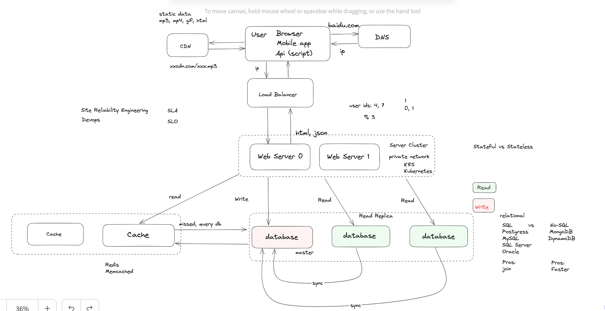
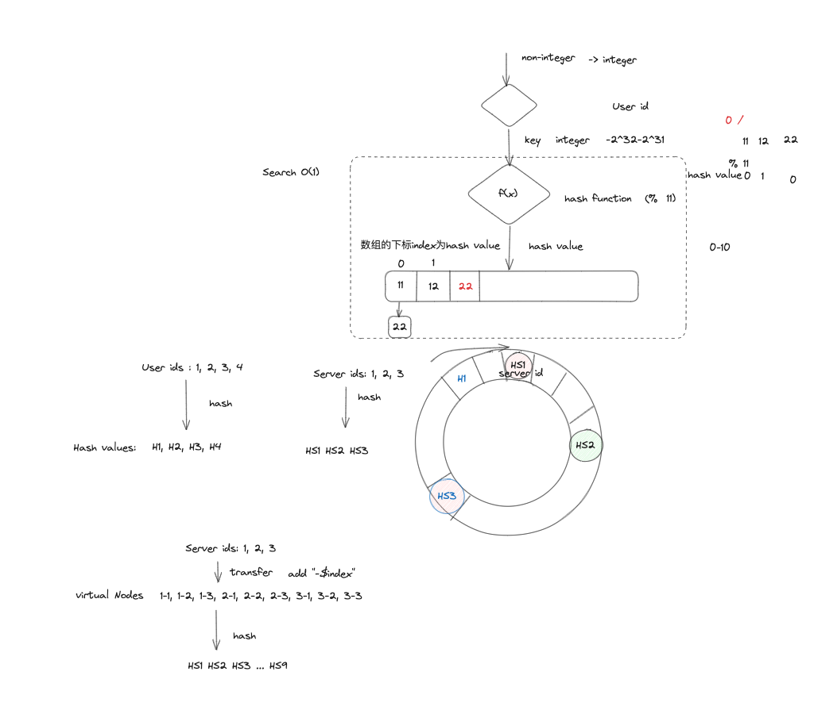

# 29 Aug 2023 - Lecture

## 系统设计

- 推荐学习检索资料参考github：
    https://github.com/donnemartin/system-design-primer/tree/master
    
### 1 user -> 1 million users 系统设计思路

- CDN概念：
> A content delivery network (CDN) is a network of interconnected servers that speeds up webpage loading for data-heavy applications. CDN can stand for content delivery network or content distribution network. When a user visits a website, data from that website's server has to travel across the internet to reach the user's computer. If the user is located far from that server, it will take a long time to load a large file, such as a video or website image. Instead, the website content is stored on CDN servers geographically closer to the users and reaches their computers much faster.

- 如果single point服务器下线怎么办？

>可以添加一个server cluster(在private network 里面)
优势：可以分流，可以backup。

- Site Reliabulity Engineering(SRA)
> Site reliability engineering (SRE) is the practice of using software tools to automate IT infrastructure tasks such as system management and application monitoring. Organizations use SRE to ensure their software applications remain reliable amidst frequent updates from development teams.

- Read Replica:
> A read replica is a copy of the primary instance that reflects changes to the primary in almost real time, in normal circumstances. You can use a read replica to offload read requests or analytics traffic from the primary instance. Additionally, for disaster recovery, you can perform a regional migration.

- SLA(Service Level Agreements): 
> An SLA (service level agreement) is an agreement between provider and client about measurable metrics like uptime, responsiveness, and responsibilities. 

- SLO(Service Level Objectives):
> An SLO (service level objective) is an agreement within an SLA about a specific metric like uptime or response time. So, if the SLA is the formal agreement between you and your customer, SLOs are the individual promises you’re making to that customer. SLOs are what set customer expectations and tell IT and DevOps teams what goals they need to hit and measure themselves against.

- SLI(Service Level Indicator):
> An SLI (service level indicator) measures compliance with an SLO (service level objective). So, for example, if your SLA specifies that your systems will be available 99.95% of the time, your SLO is likely 99.95% uptime and your SLI is the actual measurement of your uptime. Maybe it’s 99.96%. Maybe 99.99%. To stay in compliance with your SLA, the SLI will need to meet or exceed the promises made in that document.

- Latency粗略估计
    - CPU 计算 10ns     1s
    - 内存读取  100us    3hrs
    - 硬盘读取  10ms     10days
    - 网络IO    10ms    10days

- Compute types
    - CPU bounded
    - IO bounded

    
|| SQL | No SQL |
|-|-----|-------|
||Postgress|MongoDB|
||MySQL|DynamoDB|
||SQL Server||
||Oracle||
|Pros|join|faster|
- example tech stacks:
> Oracle + IBM Server + EMC2 Storage

- 解题思路：
1.理解问题，确认边界
    - 学会提问，比如有多少用户，多少流量
2. 给出设计稿
    - load balancer, web server, database, etc.
3. 填充具体细节
    - 实现具体的需求 
4. 总结
    - 回答follow-up
    - 其他可能的设计 

    
### 系统设计实例：

